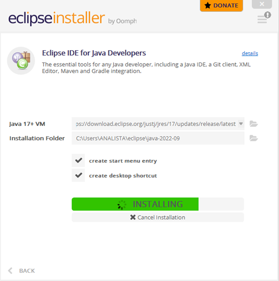
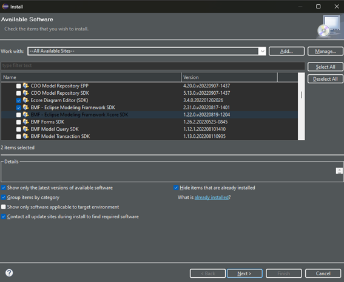
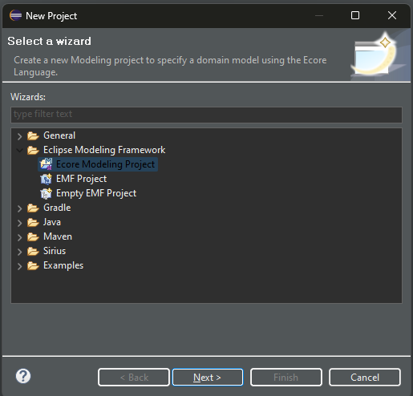
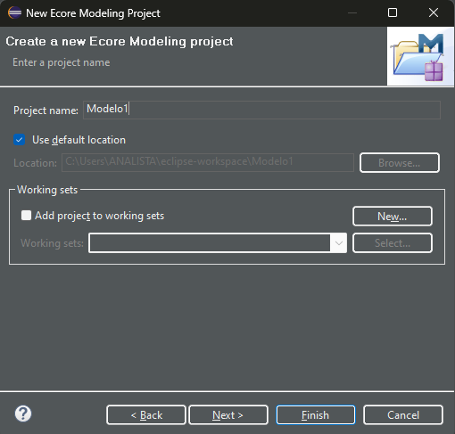
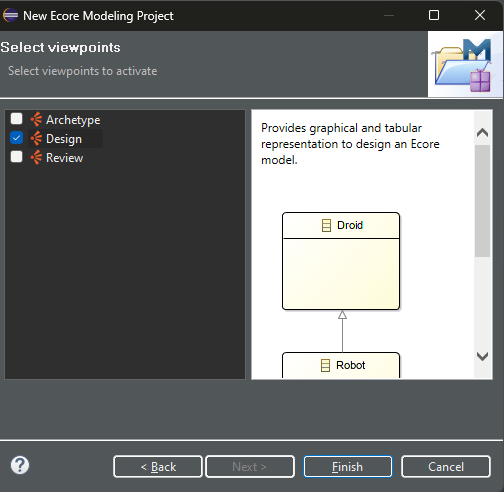

# Guía instalación Modeling Plugins

Esta es una guía de instalación de Eclipse y los plugins Ecore Diagram Editor y Modeling Framework SDK.
Ir a la página de Eclipse Foundation [Página instaladores](https://www.eclipse.org/downloads/).

## 1. Instalar Eclipse

## 2. Instalar plugins Ecore Diagram Editor y Modeling Framework SDK.

### Reiniciar IDE.

## 3. Crear Ecore Modeling Project.

### Colocar un nombre a nuestro proyecto

### Escoger la opción Design y Finalizar

