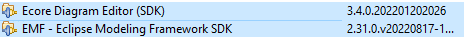

# Guía instalación Modeling Plugins

Esta es una guía de instalación de Eclipse y los plugins Ecore Diagram Editor y Modeling Framework SDK.
Ir a la página de Eclipse Foundation [Página instaladores](https://www.eclipse.org/downloads/).

## Instalar Eclipse

## Abrir opción Install New Software

## Escoger -- All Available Sites --

## Seleccionar plugins Ecore Diagram Editor y Modeling Framework SDK e instalar

### Reiniciar IDE.
